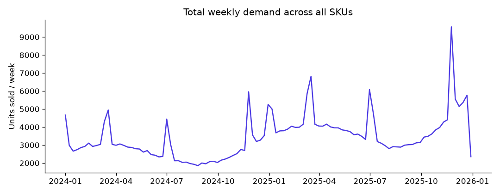
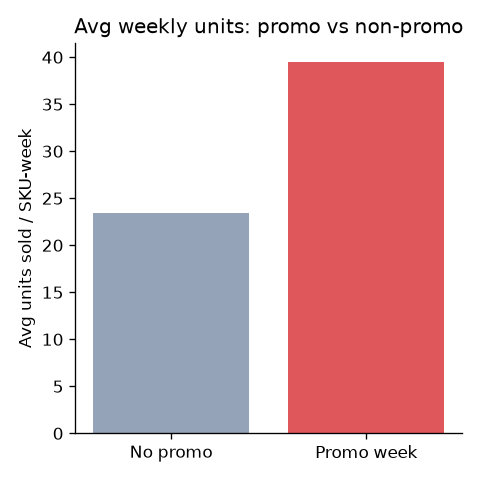
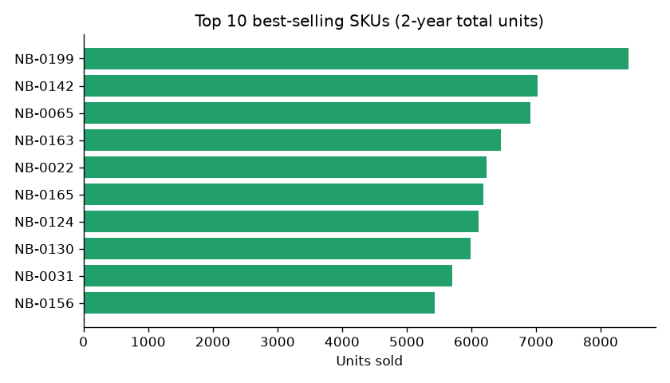
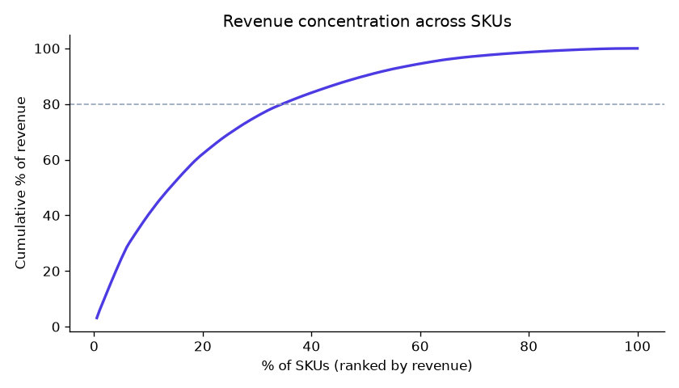
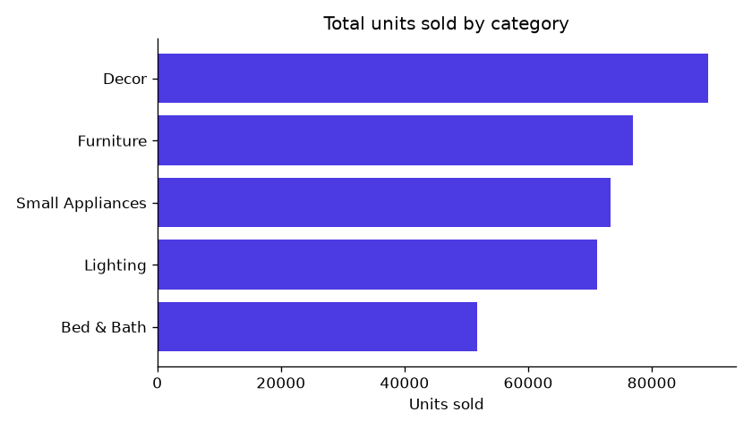

# Data-Quality & EDA Insight Memo

**Project FORESIGHT — NorthBay Living** · Prepared by: Data Science intern (Zidio Development) · Deliverable D2

---

## 1. Data-quality issues found and how they were handled

The four raw extracts (`sales_daily`, `sku_master`, `calendar`, `inventory_snapshots`) contained the
issues below. All fixes are coded in `src/pipeline.py` and re-run automatically — nothing here was
cleaned by hand in a spreadsheet.

| Table | Issue | Rows affected | How it was handled |
|---|---|---:|---|
| sku_master | Duplicate `sku_id` rows | 5 | Kept first occurrence |
| sku_master | Inconsistent category labels (15 raw text variants, e.g. `"decor"`, `"Décor"`, `"DECOR "`) | 205 | Canonicalised to 5 clean categories via a lookup map |
| sku_master | Missing `unit_cost` | 6 | Imputed with the category median |
| sales_daily | Duplicate `(date, sku_id)` rows | 40 | Kept first occurrence |
| sales_daily | Negative `units_sold` (entry errors) | 14 | Took absolute value |
| sales_daily | Missing `unit_price` | 971 | Imputed with the SKU's own median price (global median as fallback) |
| sales_daily | Missing/inconsistent `revenue` | 971 | Recomputed as `units_sold × unit_price` rather than trusted as-is |
| inventory_snapshots | Duplicate `(date, sku_id)` snapshots | 10 | Kept first occurrence |
| inventory_snapshots | Missing `on_order_units` | 139 | Filled with 0 (assume nothing currently on order) |

**Net result:** 200 valid SKUs, 105 weeks of history (Jan 2024 – Dec 2025), no orphaned foreign keys
between tables after cleaning. The full machine-readable log is in `reports/data_quality_log.json`.

---

## 2. Demand patterns: seasonality, trend, top movers, dead stock

- **Seasonality is strong and repeatable.** Demand spikes align with the promo calendar — New Year
  Clearance, Spring Refresh, Summer Sale, and a pronounced Black Friday/Cyber Monday peak each
  November. The 2025 BFCM week hit the highest demand of the whole two-year history.
- **Coefficient of variation of weekly demand is 0.35** — meaningful week-to-week swings that a flat
  average would miss, which is exactly why SKU-level, calendar-aware forecasting (not a single
  company-wide number) matters here.
- **Promotions lift demand by ~69%** on average (mean units/SKU-week: promo vs non-promo weeks) —
  the single largest driver in the data after baseline SKU popularity.

- **Top movers:** the top 5 SKUs by 2-year volume (NB-0199, NB-0142, NB-0065, NB-0163, NB-0022)
  each sold 6,200–8,400+ units, roughly 150–250x the bottom-selling SKUs.

- **Revenue concentration:** the top 20% of SKUs by revenue account for **62.1%** of total revenue —
  a Pareto-style pattern typical of D2C catalogs. Stocking accuracy on this top slice matters
  disproportionately to cash and revenue.

- **Category mix:** Decor leads by volume (89,142 units), followed by Furniture, Small Appliances,
  and Lighting; Bed & Bath is the smallest category by units sold.

- **Dead stock:** using an 8-week no-sales window (for SKUs with at least 8 weeks of history), **0
  SKUs** currently qualify as dead stock in this dataset — encouraging, but the risk-scoring layer
  (D4) still flags slow-moving SKUs on a continuous overstock score rather than relying on a hard
  cutoff, since a binary "dead or not" view would miss early warning signs.

---

## 3. Business-relevant insights (plain language)

1. **Promotions work, but they also distort the signal.** A ~69% average demand lift during promo
   weeks means any forecast that ignores the promo calendar will systematically under-predict
   promo weeks and over-predict the weeks right after (a post-promo demand "hangover" is visible
   in the trend chart). The forecasting model uses promo flags explicitly to correct for this.
2. **A small slice of SKUs carries most of the business.** With 62% of revenue concentrated in the
   top 20% of SKUs, stockouts on these specific products cost far more than an average SKU-level
   stockout — the risk-scoring layer's rupee-value-at-stake ranking (Section 08 of the brief) is
   what lets the ops team prioritise correctly instead of treating all 200 SKUs equally.
3. **New-SKU sparsity is a real forecasting challenge.** ~12% of SKUs launched within the last 90
   days of the dataset and have too little history for reliable SKU-level lag features. The model
   falls back to category-level rolling demand for these SKUs (see `src/features.py`,
   `cat_roll_mean_8`), consistent with the brief's suggested mitigation for sparse history.

---

## 4. Data caveats for the reader

- This is simulated data modelled on a realistic D2C brand, not NorthBay's real systems — patterns
  are representative but exact figures (e.g. total revenue) are illustrative, not real business
  numbers.
- Inventory snapshots are weekly, not daily, so short intra-week stock swings are smoothed out.
- All charts and figures above are reproducible by re-running `python src/eda.py` after
  `python src/pipeline.py`; no numbers in this memo were entered by hand.

*Full data-quality log: `reports/data_quality_log.json` · Full EDA stats: `reports/eda_stats.json`*
